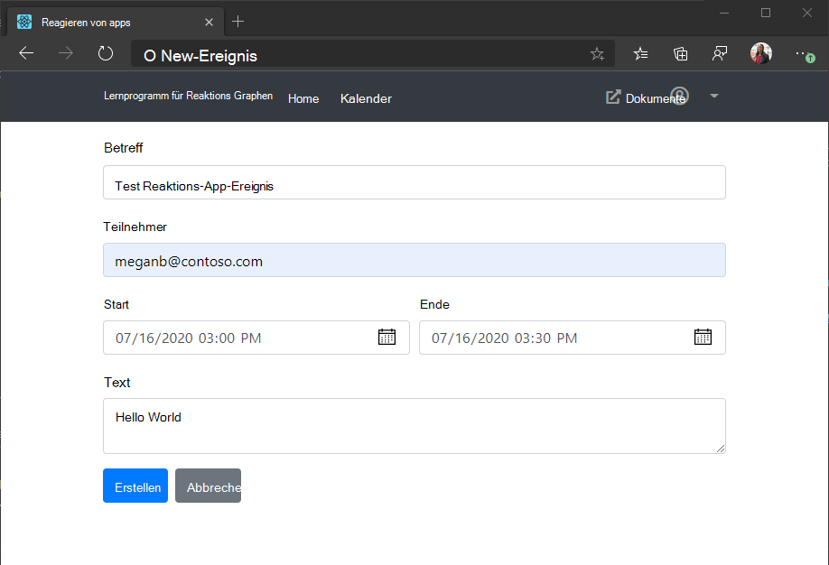

<!-- markdownlint-disable MD002 MD041 -->

<span data-ttu-id="8bb65-101">In diesem Abschnitt können Sie die Möglichkeit zum Erstellen von Ereignissen im Kalender des Benutzers hinzufügen.</span><span class="sxs-lookup"><span data-stu-id="8bb65-101">In this section you will add the ability to create events on the user's calendar.</span></span>

## <a name="add-method-to-graphservice"></a><span data-ttu-id="8bb65-102">Add-Methode zu GraphService</span><span class="sxs-lookup"><span data-stu-id="8bb65-102">Add method to GraphService</span></span>

1. <span data-ttu-id="8bb65-103">Öffnen Sie **/src/GraphService.TS** , und fügen Sie die folgende Funktion hinzu, um ein neues Ereignis zu erstellen.</span><span class="sxs-lookup"><span data-stu-id="8bb65-103">Open **./src/GraphService.ts** and add the following function to create a new event.</span></span>

    :::code language="typescript" source="../demo/graph-tutorial/src/GraphService.ts" id="createEventSnippet":::

## <a name="create-new-event-form"></a><span data-ttu-id="8bb65-104">Erstellen eines neuen Ereignis Formulars</span><span class="sxs-lookup"><span data-stu-id="8bb65-104">Create new event form</span></span>

1. <span data-ttu-id="8bb65-105">Erstellen Sie eine neue Datei im **./src** -Verzeichnis mit dem Namen "New **Event. TSX.** ", und fügen Sie den folgenden Code hinzu.</span><span class="sxs-lookup"><span data-stu-id="8bb65-105">Create a new file in the **./src** directory named **NewEvent.tsx** and add the following code.</span></span>

    :::code language="typescript" source="../demo/graph-tutorial/src/NewEvent.tsx" id="NewEventSnippet":::

1. <span data-ttu-id="8bb65-106">Öffnen Sie **/src/app.TSX** , und fügen Sie die folgende `import` Anweisung am Anfang der Datei hinzu.</span><span class="sxs-lookup"><span data-stu-id="8bb65-106">Open **./src/App.tsx** and add the following `import` statement to the top of the file.</span></span>

    ```typescript
    import NewEvent from './NewEvent';
    ```

1. <span data-ttu-id="8bb65-107">Fügen Sie dem neuen Ereignis Formular eine neue Route hinzu.</span><span class="sxs-lookup"><span data-stu-id="8bb65-107">Add a new route to the new event form.</span></span> <span data-ttu-id="8bb65-108">Fügen Sie den folgenden Code direkt nach den anderen `Route` Elementen hinzu.</span><span class="sxs-lookup"><span data-stu-id="8bb65-108">Add the following code just after the other `Route` elements.</span></span>

    ```typescript
    <Route exact path="/newevent"
      render={(props) =>
        this.props.isAuthenticated ?
          <NewEvent {...props} /> :
          <Redirect to="/" />
      } />
    ```

    <span data-ttu-id="8bb65-109">Die vollständige `return` Anweisung sollte nun wie folgt aussehen.</span><span class="sxs-lookup"><span data-stu-id="8bb65-109">The full `return` statement should now look like this.</span></span>

    :::code language="typescript" source="../demo/graph-tutorial/src/App.tsx" id="renderSnippet" highlight="23-28":::

1. <span data-ttu-id="8bb65-110">Aktualisieren Sie die APP, und navigieren Sie zur Kalenderansicht.</span><span class="sxs-lookup"><span data-stu-id="8bb65-110">Refresh the app and browse to the calendar view.</span></span> <span data-ttu-id="8bb65-111">Klicken Sie auf die Schaltfläche **Neues Ereignis** .</span><span class="sxs-lookup"><span data-stu-id="8bb65-111">Click the **New event** button.</span></span> <span data-ttu-id="8bb65-112">Füllen Sie die Felder aus, und klicken Sie auf **Erstellen**.</span><span class="sxs-lookup"><span data-stu-id="8bb65-112">Fill in the fields and click **Create**.</span></span>

    
